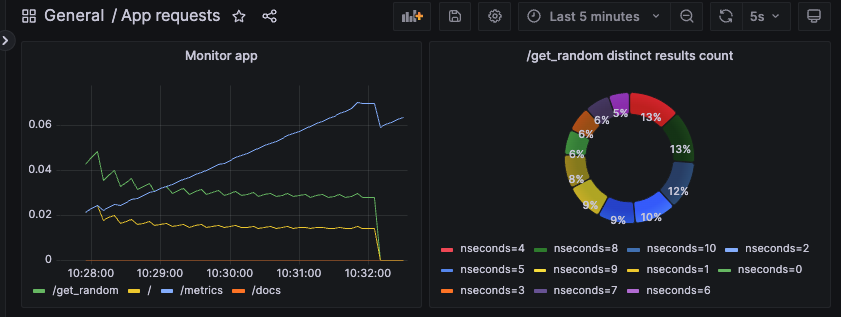

# System Deployments

## Tech stack
1. AWS + Terraform
    ```mermaid
    flowchart LR;
        subgraph A[VPC];
            subgraph AA[Public Subnet]
            end
            subgraph AB[Private Subnet]
                direction LR;
                subgraph ABA[Fargate]
                    direction TB;
                    ABA1[ECS]
                    ABA2[ECS]
                    ABA3[ECS]
                end
                ABB[NLB] --> ABA;
                ABC[APIGW] --> ABB;
            end
            AC[Internet Gateway] --> AA;
            AA --> AD[NAT];
            AD --> AB;
        end;
        B[ECR] --> AC;
        C[Cognito] --> AC;
    ```
2. Azure bicep
    ```mermaid
    flowchart LR;
        subgraph B[Azure Cloud]
            direction TB;
            B1[ACR];
            B2[Key Vault];
            subgraph BA[Container Apps]
                BA1[frontend] --> BA2[backend];
            end
            subgraph BB[Serverless]
                BB1[EventGrid] --> BB2[Function Apps];
                BB2 --> BB3[OCR];
            end
            subgraph BC[Storage]
                BC1[Blob]
                BC2[CosmosDB]
            end
            B1 --> BA;
            BA --> BC;
            BC --> BA;
            BC --> BB;
            BB --> BC;
            BB --> BA2;
        end
        subgraph A[Azure Devops]
            subgraph AA[Repository]
                subgraph AAA[CICD Pipeline]
                    AAA1[CI Testings]
                end
                AAA -->|package| AAB[Artefacts]

            end
        end
        A -->|docker image| B1;
        A -->|iac| B;
        BA2 -->|install package| A;
        C((User)) --> BA1;
    ```
3. Dockers + Helm + Kubernetes
    ```mermaid
    flowchart LR;
        subgraph AA[Node]
            direction LR;
            subgraph A[Deployment]
                A1[Pod];
                A2[Pod];
                A3[Pod];
            end
        end
        B[NodeIP] --> AA;
    ```
4. Google Cloud Platform
    ```mermaid
    flowchart LR;
        A[Artifact Registry] --> B[Cloud Run];
    ```
5. FastAPI + Prometheus + Grafana
    ```mermaid
    flowchart LR;
        A[FastAPI] -->|/metrics| B[Prometheus];
        B --> C[Grafana]
    ```
    

## Archive
- API calls
    ```mermaid
    sequenceDiagram
        participant app;
        participant api;
        participant location_api;
        participant sensor_api;
        participant prediction_api;
        Note over app: requirements <br>- delay: 2s;
        app->>+api: GET;
        Note over location_api: <br>- endpoint: /location <br>- delay: 0.5s;
        api->>+location_api: GET /location;
        location_api-->>-api: return (lat,lng);
        Note over sensor_api: <br>- endpoint: /sensor <br>- delay: 2s;
        api->>+sensor_api: GET /sensor?lat,lng;
        sensor_api-->>-api: return (timestamp, sensor_data);
        Note over prediction_api: <br>- endpoint: /predict <br>- delay: 4s;
        api->>+prediction_api: GET /sensor?lat,lng,sensor_data;
        prediction_api-->>-api: return (prediction_data);
        api-->>-app: ;
    ```
- MLOps
    ```mermaid
    flowchart TB;
        subgraph A[Continuous Integration]
            direction TB
            subgraph AA[Data]
                AAB[Database] --- AAA[Artefacts];
            end
            subgraph AB[Preprocessing]
                ABA[Exploration] --> ABB[Processing];
                ABB-->ABC[Feature Extraction];
            end
            subgraph AC[Model]
                ACA[Model Selection]-->ACB[Train];
                ACB-->ACC[Validate];
                ACC-->ACD[Model Registration];
                ACD-->ACA;
            end
            AA-->|batch/stream processing|AB;
            AB-->|features|AA;
            AC-->|model artefacts|AA;
            AA-->AC;
        end
        a((client));
        a-->|raw data|AA;
        subgraph B[Continuous Deployment]
            direction LR
            subgraph BA[Deploy]
                BAA[Containers]-->BAB[Servers];
                BAB-->BAC[Load Balancer] & BAD[Logging];
            end
            subgraph BB[Monitoring]
                BBA[Visualisation Tool];
            end
            BAD-->BBA;
        end
        AC-->B;
        B-->|endpoints, kpis|a;
    ```
    |Role|Responsibilities|
    |---|---|
    |Data engineer|Data, Preprocessing|
    |Data scientist|Preprocessing, Model|
    |ML engineer|Preprocessing, Model, Deploy|
    |Devops|Deploy, Monitoring|

    |Responsibility|Skills|
    |---|---|
    |Data|SQL, Postgresql, Pgadmin, SQLAlchemy, SQLModel, Alembic|
    |Preprocessing|Spark, Pandas, Databricks|
    |Model|Tensorflow, Pytorch, MLflow|
    |Deploy|FastAPI, Tensorflow, Pytorch, Prometheus|
    |Monitoring|Prometheus, Grafana|

- Kafka Broker and Database Crash
    ```mermaid
    flowchart LR;
        A[Collectors]-->B[Kafka Broker];
        subgraph C[Workers]
            C1[Worker1];
            C2[Worker2];
        end
        B-->|work1 topic|C1;
        B-->|work2 topic|C2;
        subgraph D[Database]
            D1[Table1];
            D2[Table2];
        end
        C1-->|1. write|D1;
        D-->|2. crash|D;
        C2-->|3. disconnect, can't write|D2;
    ```
    ```mermaid
    ---
    displayMode: compact
    ---
    gantt
        title Workers Timetable
        dateFormat HH:mm
        axisFormat %H:%M
        tickInterval 1hour

        section Worker 1
        w1: a1, 00:20, 15m
        w1: a1, 02:20, 15m
        w1: a1, 04:20, 15m
        w1: a1, 06:20, 15m
        w1: a1, 08:20, 15m
        w1: a1, 10:20, 15m

        section Worker 2
        w2: a2, 00:00, 1h
        w2: a2, 04:00, 1h
        w2: a2, 08:00, 1h
    ```

## Others
1. Compnay Hierarchy
    ```mermaid
    flowchart TB;
        A[root]-->B;
        subgraph B[scope];
            direction TB;
                B1[service-publisher];
                B2[infra-builder];
                B3[developer];
        end

        subgraph C[service];
            direction TB
                C1[ecr];
                C2[ecs];
                C3[s3];
        end

        E[(credentials)];
        F[(AWS Management Console)];

        D[Leo]-->B3;
        B1 -->|push| C1;
        B2 -->|build| C1 & C2 & C3;
        B3 -->|read| C1 & C3;
        D --> E;
        B1 --> E;
        B2 --> E;
        D & A -->|access| F;
    ```
