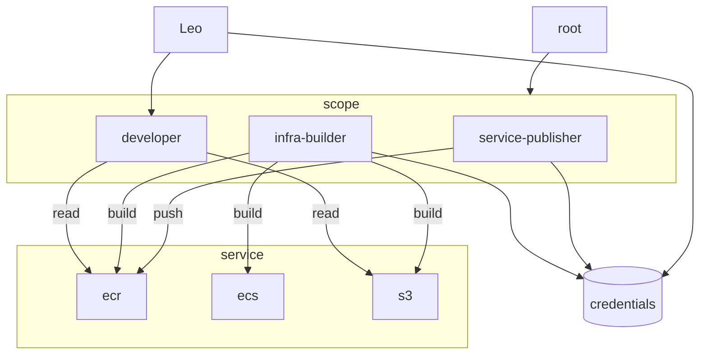

```mermaid
flowchart TB;
    A[root]-->B;
    subgraph B[scope];
        direction TB;
            B1[service-publisher];
            B2[infra-builder];
            B3[developer];
    end

    subgraph C[service];
        direction TB
            C1[ecr];
            C2[ecs];
            C3[s3];
    end

    E[(credentials)];

    D[Leo]-->B3;
    B1 -->|push| C1;
    B2 -->|build| C1 & C2 & C3;
    B3 -->|read| C1 & C3;
    D --> E;
    B1 --> E;
    B2 --> E;
    

```