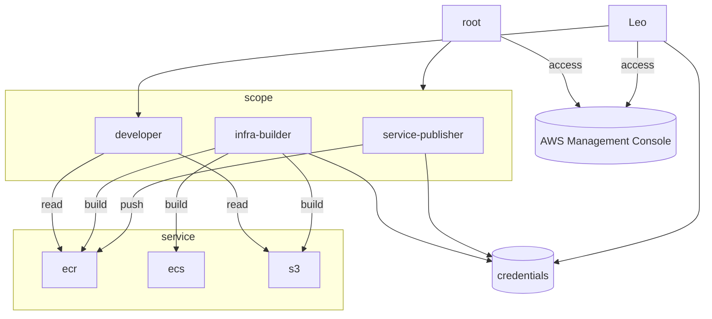

## Create a company from scratch
1. Only manual part, create aws account resulting in root user.
2. Create S3 bucket for backend.
3. Create IAM roles and policies from terraform to structure the entities (all other users).

