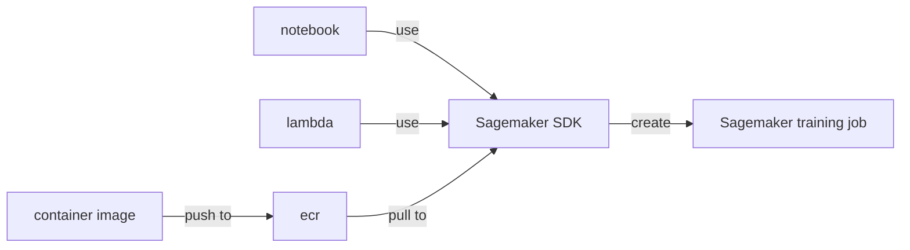

```mermaid
flowchart LR;
    A[container image] -->|push to| B[ecr];
    C[notebook] & F[lambda] -->|use| D[Sagemaker SDK];
    B -->|pull to| D;
    D -->|create| E[Sagemaker training job];
```

## How to run?
1. Build and push docker image for training.
    ```
    docker build -t dummy-sagemaker-train --platform linux/amd64 .
    ```
