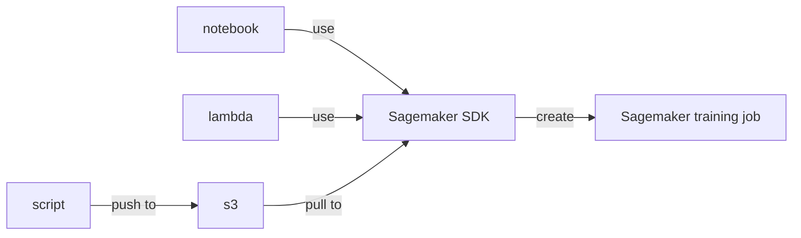

## Deployment Strategies



## How to run?
- Local
    ```
    python src/train.py --train ../data --epochs 3 --model_dir ../model
    ```
- Sagemaker

## References
1. https://github.com/aws/amazon-sagemaker-examples/blob/main/sagemaker-python-sdk/tensorflow_script_mode_training_and_serving/mnist-2.py
2. https://github.com/aws/amazon-sagemaker-examples/blob/main/advanced_functionality/custom-training-containers/basic-training-container/notebook/basic_training_container.ipynb
3. https://sagemaker.readthedocs.io/en/stable/frameworks/tensorflow/using_tf.html#id1
4. https://docs.aws.amazon.com/sagemaker/latest/dg/tensorboard-on-sagemaker.html
